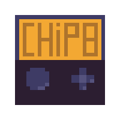
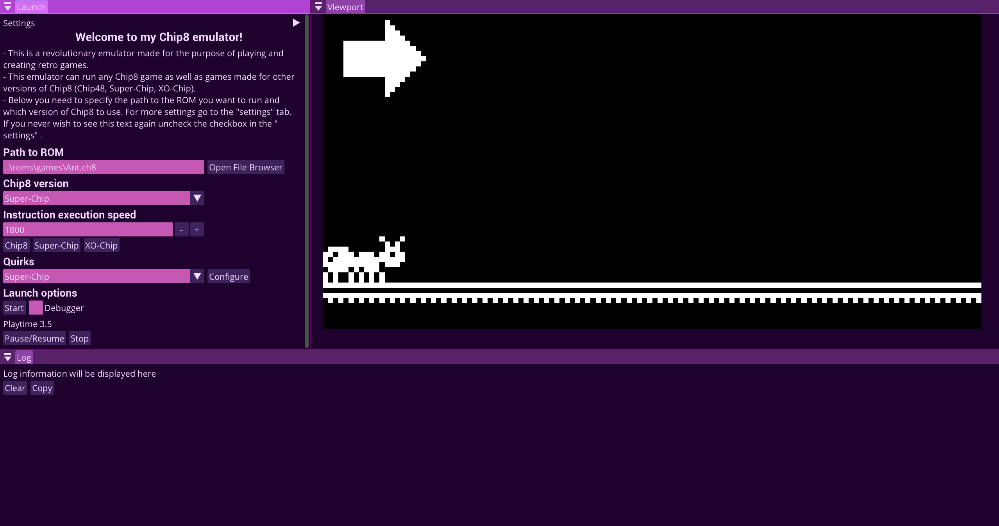
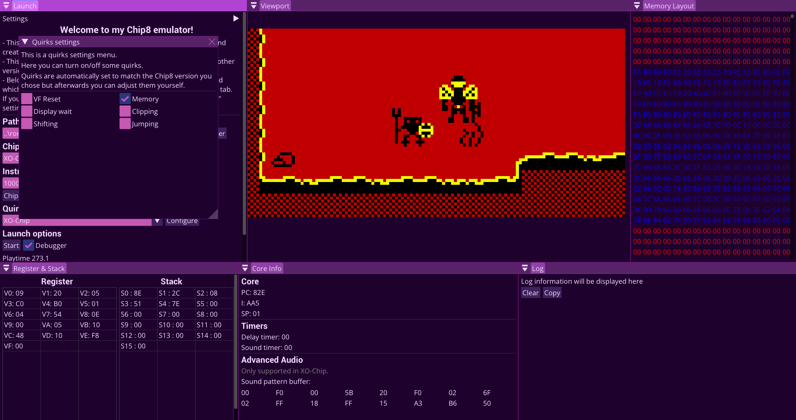

# Chip-8 emulator 

Chip-8 emulator written in modern C++.

## Table of contents

* [Versions](#versions)
* [Quirks](#quirks)
* [User Interface](#user-interface)
* [Dependencies](#dependencies)
* [Screenshots](#screenshots)
* [Debugging](#debugging)
* [Resources](#resources)
* [License](#license)

## Versions
This emulator support various version of Chip8
 including:

* Original Chip8 that runs older games.
* Chip48 with modern instructions and quirks.
* Super-Chip with increased screen size and new instructions.
* XO-Chip, supports up to 4 different colors, new instructions and advanced sounds.

## Quirks
To maximize compatability it is also possible to adjust individual quirks.
With this feature you can emulate the behavior of legacy Super-Chip or 
player Chip48 or Super-Chip games on XO-Chip.

List of available quirks:
* **VF Reset** - Instructions `8XY1` `8XY2` `8XY3` set` VF` to `0` when turned on.
* **Display wait** - This quirk does not affect the emulator in any way yet.
* **Memor**y - Instructions `FX55` and `FX65` will increment index register if on.
* **Clipping** - Sprites at the edge of the screen will be clipped instead of wrapped.
* **Shifting** - Opcodes `8XY6` and `8XYE` only operate on `VX` value and ignore `VY`.
* **Jumping** - Jump to address `NNN` plus `VX` instead of `V0`.

In the top bar you can adjust the settings for both colors and audio - to match each
game.

## User Interface
**imgui** library is used for creating and managing dynamic windows and widgets. I specifically used
**docking** branch of **imgui** to allow windows to be attached to each other to make using the emulator
easier. By default, `imgui.ini` file is shipped with the executable so the windows will have a default position,
but feel free to change and move around them as you want.

## Dependencies
This emulator uses libraries such as **SDL3** and **imgui**.
- **SDL3** for rendering, user input, and audio.
- **imgui** for User Interface.
- **imgui_filebrowser** extension was also used to be able to use file browsing in emulator.

## Debugging
My emulator supports a debugging mode to help you debug and create your own Chip8 games 
as well as create your own emulators by comparing their behavior. 
If you turn `Debugger` on in the Launcher settings you will be able to see
several windows.
- **Memory layout** will display the RAM of the Chip8. Bytes colored Red are reserved for the 
 Chip8 itself and the ones colored Blue are bytes used to store different fonts. Anything
after them can be used to store the game's ROM data.
- **Register & Stack** window displays the current values of register and the stack.
- **Core** shows information about the core of the Chip8, including PC, SP, I, timers and audio pattern buffer.

In debug mode you also can step through instructions if you pause the game. It can be useful to
debug register values or other changes in the program.

## Resources

To develop this emulator I used various resources. Firstly, I got to know the specifications
and some technical details from this first **Austin Morlan's Tutorial**. Then, I followed the **Guide to making a Chip-8 emulator** for more in-depth 
explanation of how instructions work and behave depending on the platform.

* [Austin Morlan Tutorial](https://austinmorlan.com/posts/chip8_emulator/)

* [Tvil's Guide to making a Chip-8 emulator](https://tobiasvl.github.io/blog/write-a-chip-8-emulator/)

## License
This project is distribute under **MIT License**.

You can see find it here [LICENSE](https://github.com/StanislavDidus/Chip-8/blob/main/LICENSE)

## Screenshots

